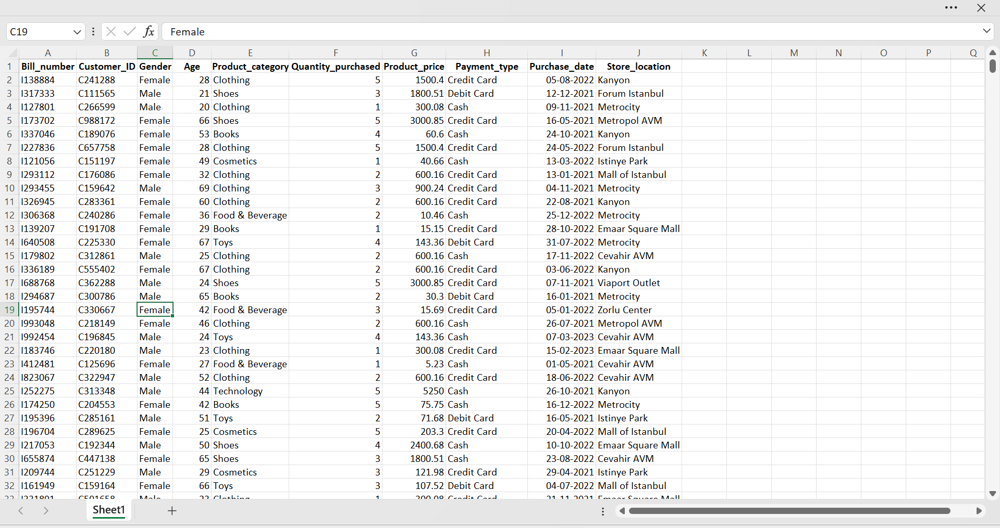

## 🛒 Strategic Product Placement Analysis 📈

### Project Description

Strategic Product Placement Analysis is a Tableau-based retail analytics project that analyzes the relationship between product positioning, sales performance, and customer purchasing behavior.

This project uses retail transaction data to identify the effectiveness of different product placement strategies, analyze product category performance, and evaluate store location sales. Interactive dashboards and visualizations are created using Tableau to generate actionable insights that help retailers optimize product placement decisions and improve revenue growth.

### Technologies Used

- Tableau
- Excel / CSV
- HTML
- Data Visualization
- Data Analytics


### Key Features

* Sales performance analysis
* Product placement impact analysis
* Category-wise sales insights
* Store location performance analysis
* Interactive Tableau dashboard

---

### Project Screenshots

### 1. Dataset Preview


 CSV/Excel dataset

### 🏠 Tableau Dashboard


### 📌 Product Placement vs Sales Performance


### 📦 Product Category Sales Distribution


### 🏬 Store Location Sales Performance


### 🌐 Web Integration

- Tableau dashboard embedded into HTML webpage.
- Provides easy access to interactive analytics.
### Integration Link: http://127.0.0.1:5500/Strategic%20Product%20Placement%20Analysis.html
---

## 📈 Dashboard Features

- Interactive Tableau Dashboard
- Sales performance analysis
- Product placement analysis
- Category-wise sales insights
- Store location comparison
- Data filters for better analysis


### Project Structure

```
Strategic-Product-Placement-Analysis
│
├── Dataset
├── Tableau Dashboard
├── Story
├── Web Integration
└── README.md
```


## 🔍 Key Insights

- Identified high-performing product placements.
- Analyzed customer purchase patterns.
- Compared category-wise sales performance.
- Evaluated store location performance.

---

## 🚀 Future Scope

- Real-time sales data integration.
- Sales prediction using Machine Learning.
- Advanced customer segmentation.

---

## 👩‍💻 Author

**Narapureddy Lokitha**

